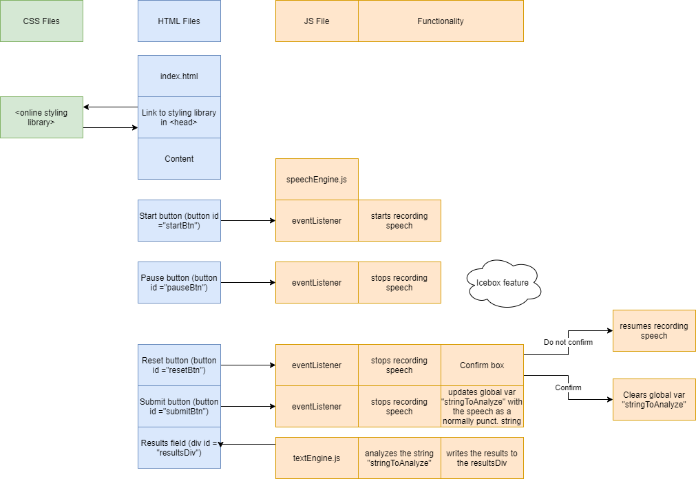

# InterviewEQ
[InterviewEQ](https://maximilliancharlemagne.github.io/emotion-engine/) is an app designed specifically for developers who want to build their soft skills to get jobs. Technically qualified coders can still fail to connect with the interviewer. InterviewEQ exists to help solve that problem.

# Team
Amanda Cerjak: https://github.com/acerjak

Ian Kirby: https://github.com/vertjames

Kasey Agapinan: https://github.com/agapinank

Maxwell Roberts: https://github.com/maximilliancharlemagne

# Tech Overview
Using the [Web Speech API](https://developer.mozilla.org/en-US/docs/Web/API/Web_Speech_API) we convert the user's speech to text, then analyze prominent emotions in that text using the [ParallelDots Emotion Analysis API](https://www.paralleldots.com/text-analysis-apis#emotion), and display the results of that analysis for the user. 

## Control Flow Diagram:

# Functionality
Click the 'Start' button to begin recording. This records your speech and processes it through the Web Speech API, converting it into text. Click the 'Submit' button to stop recording and submit the text for emotional analysis via the ParallelDots API. Results are presented at the bottom of the page.

